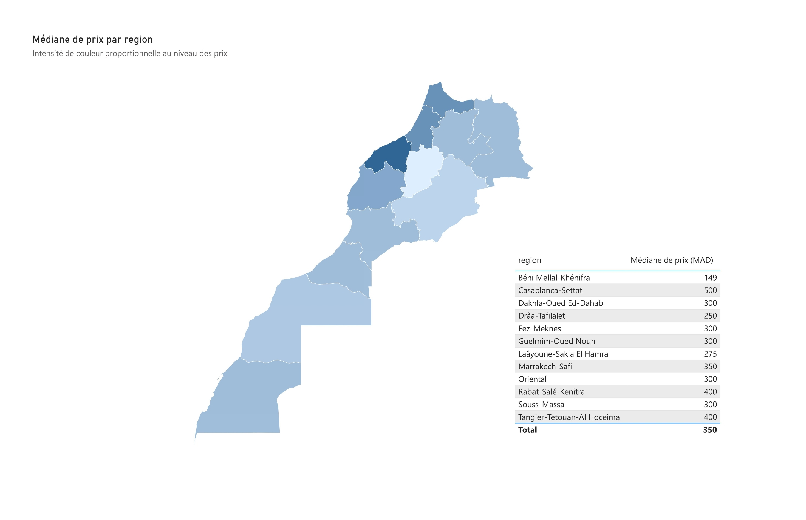
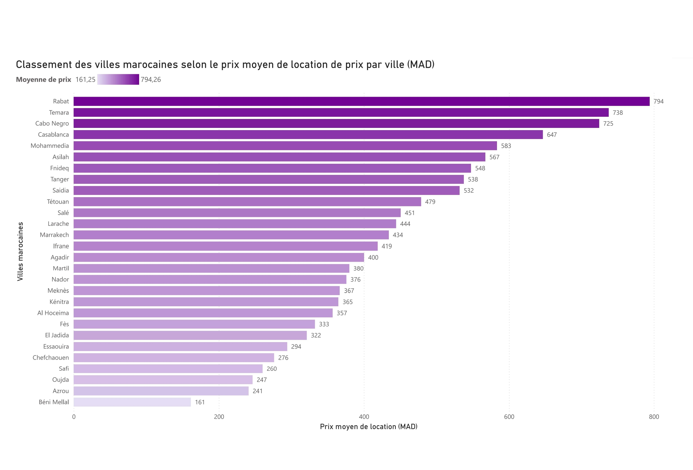
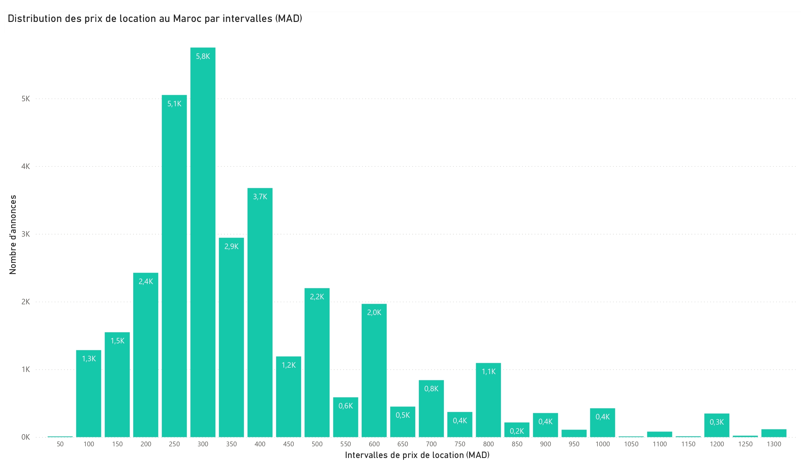
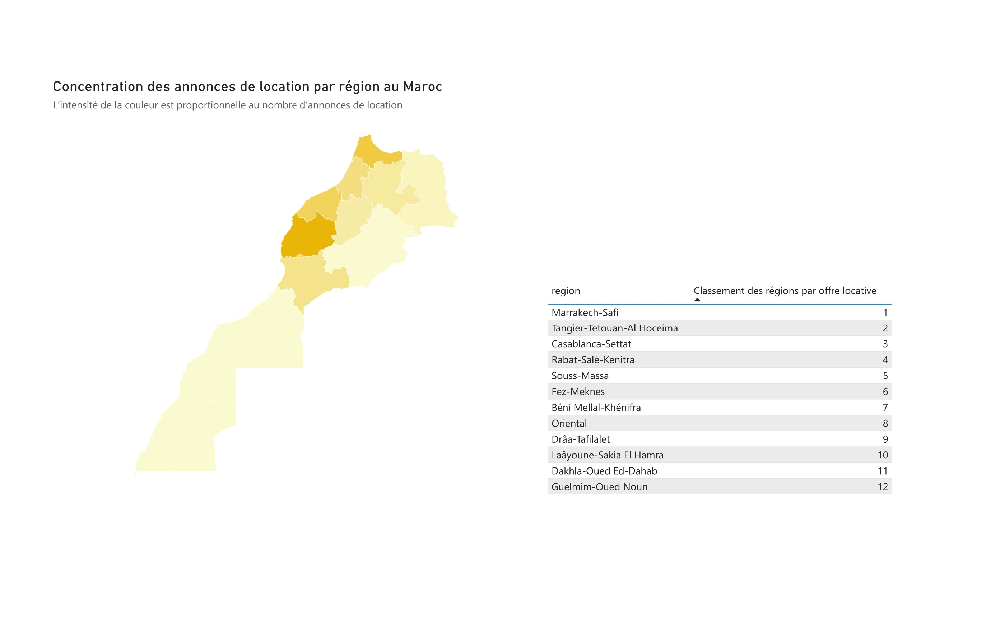
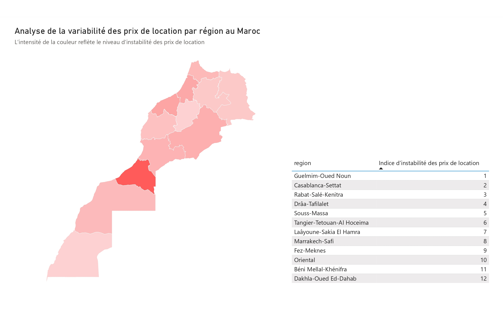
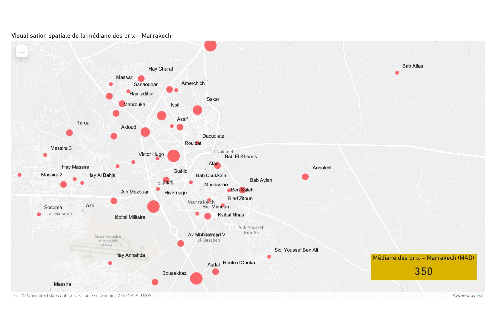
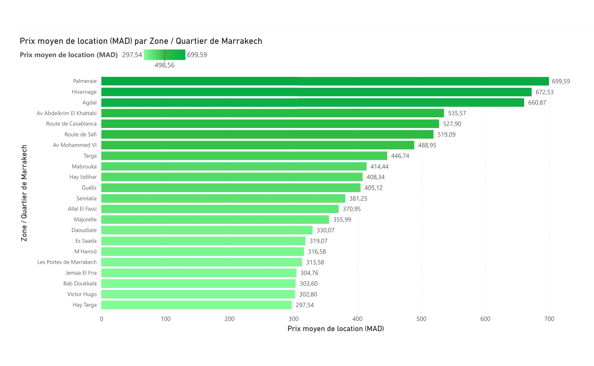
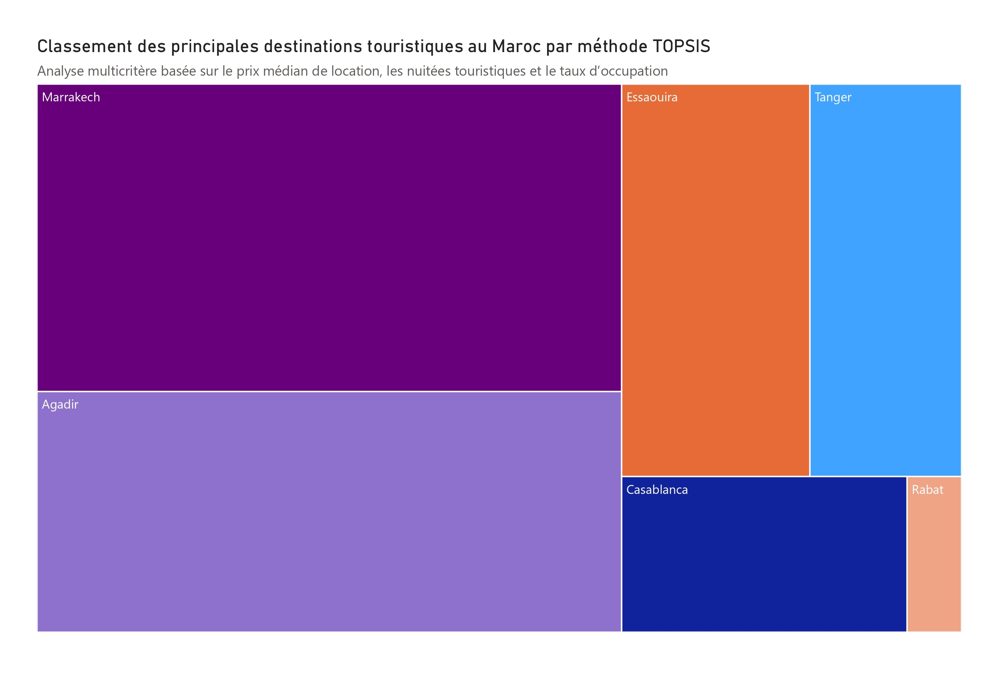

## Median Rent Map by Region (Morocco)

This map shows the spatial distribution of median rental prices across Moroccan regions. Darker colors indicate higher median rents.

---

## City Ranking by Average Rent (Morocco)

Ranking of major Moroccan cities based on their average rental prices.

---

## Rental Price Distribution (Morocco)

Histogram illustrating the distribution of rental prices across all collected listings.

---

## Rental Listings Concentration by Region

This visualization highlights regions with higher concentrations of rental listings.

---

## Rental Price Variability by Region

Regional comparison of rental price variability, indicating market instability levels.

---

## Marrakech Median Rent Spatial Distribution

Spatial visualization of median rental prices across districts in Marrakech.

---

## Average Rent by District (Marrakech)

Comparison of average rental prices across different neighborhoods in Marrakech.

---

## TOPSIS Tourism City Ranking (Morocco)

Multicriteria ranking of Moroccan tourist cities using the TOPSIS method, based on rental price, tourist overnight stays, and occupancy rate.

